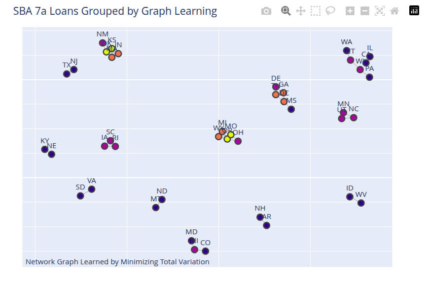

::: {.callout-note appearance="simple"}

## Note
This post was a hand-wavy sketch of an idea. It now has a concrete example.
:::

::: {style="text-align: justify"}
## Unsupervised Learning and Graphs
The problem discussed in this post is this: you have a signal recorded at different nodes of a graph. These could be prices of the same commodity at different locations, or blood sugar measurements on a given day for different individuals. You choose the graph definition and the signal to measure at each node. Can you infer which nodes to connect to create the edges of the graph based on the signal values?

The graph is considered _undirected_. The intuition is to fit a model to the nodes of the graph that _smooths_ the signal, i.e., when you connect the nodes of the graph, you get a smooth signal value. The implication is that nodes with similar values will be connected. This is a _filtering_ approach to learning a graph.

There are two unknowns here: the connectivity of the graph and the _smoothed_ signal value. The graph is defined by its _Laplacian_ matrix, $L$. This is what you want to learn. The smoothing idea is called _Total Variation Smoothing_ and is quite popular. The algorithm consists of two steps:

1. Initially, assume the smoothed signal is the same as the observed signal; in subsequent iterations, use the smoothed signal from the smoothing step (value from step 2 in the previous iteration) and learn the _Laplacian_ that makes the signal smooth.
2. Using the Laplacian from the previous step and the raw observation values, learn a smooth signal.

This is the algorithm called _GL-SigRep_ in @dong2016learning.

To validate this approach, I used the charge-offs in the _SBA 7a loans_ dataset, prepared [here](https://github.com/rajivsam/descriptive_analytics/blob/main/notebooks/sba_loans.ipynb) and available [here](https://github.com/rajivsam/descriptive_analytics/blob/main/data/sba_loans_prepared/sba_loans_stage1.csv). To prepare the data, I did the following:

1. Selected all loans that were charge-offs.

2. Grouped the results by state and computed the number of charge-offs in each state.

3. In the raw dataset, computed the number of loans for each state.

4. Computed a _charge-off rate_ for each state. This is a small number. I multiplied this by 100 to derive an attribute called _CP100_; this is the charge-off rate per 100 loans in that state.

Thus, graph nodes are the geographical states (TX, VA, etc.) and we observe the _CP100_ attribute for each state. Can we learn a graph using the _total_variation_ smoothing approach? I tried this and I think the results are good. States with similar charge-off values are grouped together. States with extreme values (high or low) are outliers and not connected to other states. This shows which states are candidates for IID analysis and which are not. Please note that this result is based on the regularization values I have used with this solution. 

The results are shown in the figure below.

{fig-align="center" width="90%"}

The notebook is available [here](https://github.com/rajivsam/descriptive_analytics/blob/main/notebooks/sba_chargeoff_loans_network.ipynb).

:::