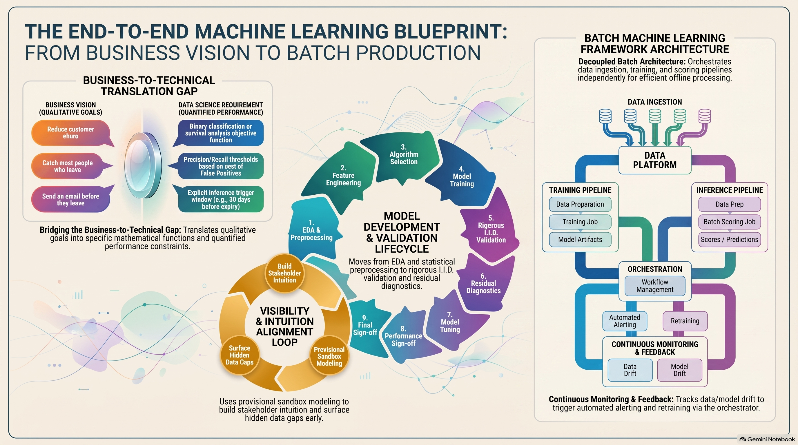
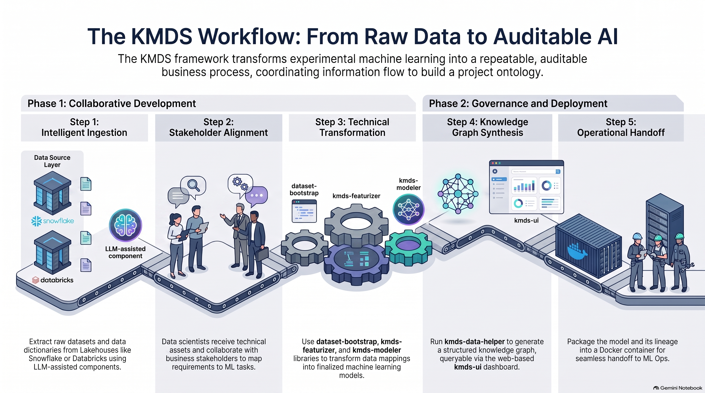

::: {style="text-align: justify"}

## The KMDS Update: Context, Changes, and Practical Implications
This post is part of a series on how KMDS has evolved as LLMs and coding agents have become standard tools for software development. In this post, I discuss the operational context for KMDS, the changes that have been made to the system, and the practical implications for enterprise data science teams.

### Evolution of KMDS
KMDS integrates coding assistants directly into its workflow. Rather than functioning as a static knowledge graph, it becomes a living system in which:

1. Coding agents support each phase of ML use case development.
2. Their outputs — datasets, features, models, and diagnostics — are assembled and coordinated as a workflow.
3. The knowledge graph keeps the process documented, reusable, and interpretable in enterprise settings.

### Making It Concrete
To make this tangible, we need a working model for developing ML models in an enterprise setting. Let’s start with three foundational questions:

1. How a use case is framed and deployed in a business or engineering environment.
2. The role of AI automation versus human expertise in guiding decisions.
3. The operating environment in which applications interact with other systems and embedded services.

Once that foundation is clear, we can show how KMDS is applied in practice. A useful schematic is shown below.

{fig-align="center"}

The basic idea is simple: building and deploying a production model happens in phases. The first phase is the initial deployment of a model to solve a business problem. This is usually the most time-consuming and difficult phase because both the business and modeling teams are learning about the problem and its operational context. The second phase is the ongoing maintenance of the model, which is usually easier because the teams have already learned about the problem and its operational context.

That initial phase usually looks like this:

1. The team first develops a clear understanding of the business problem.
2. It then translates that problem into a machine learning task, working closely with the business team to understand what data matters and how it behaves in real operations. The business explains the operational patterns; the modeling team tests that understanding, probes gaps, and defines the mapping from business needs to a canonical ML task such as classification, clustering, or regression. With modern tools like TabFM and TabDPT, a reasonable baseline model can often be built quickly. That is important: a baseline is not the final solution, but a starting point. A strong data science team can usually identify the most relevant features quickly.
3. The team then reviews the model’s results with business stakeholders, clarifies remaining gaps, and develops a shared vocabulary for interpreting the problem. Generative AI can help with both the modeling work and the communication of results.

Once stakeholders agree on performance and interpretation, the model can be deployed. Generative AI can also help package it for production. But it is equally important to remember that the model was trained on data from a specific operational window. The team should verify that performance remains consistent with expectations and assess whether business conditions have changed. This matters especially when firms retrain models on fresh data even though the current version still performs well. In retail e-commerce, for example, retraining is often practical because it adapts the model to the current operating environment without requiring heavy human analysis.

When operational procedures, planning constraints, or shifting business conditions require it, the team may adjust an existing model to a new data window. This is typically a different exercise from routine retraining because it incorporates the most recent operational period and any business changes stakeholders want to evaluate for the next model iteration. If the changes are incremental, this may not be too demanding. If a new feature or a different modeling approach is introduced, the effort can become substantial.

A few observations matter here:

1. Human agency is required to decide what counts as a good solution and what ideas the solution should be built around.
2. Human agency is required to explain why successive model versions differ. AutoML can generate predictions, but it cannot tell us why the model behaves as it does or how the business itself is evolving.
3. Human agency is required to interpret the data holistically. Automation can help with isolated results, but understanding the broader picture is arguably best done with automated tools and then validated by human experts.

This is exactly the tension KMDS is designed to manage: combining expert human judgment with the strengths of generative AI.

The batch deployment model is chosen deliberately. Online deployment is rarely worth the cost for most use cases because it offers little ROI relative to the expense. In cybersecurity, ad tech, or large-scale hyperscaler settings, real-time scoring may justify the investment. For most applications, the value of instant predictions is limited, and the cost of always-on infrastructure is not. Batch processing gives flexibility: hourly, daily, or weekly schedules can be tuned to balance freshness and operational simplicity.

The practical view is that, for small and medium businesses, building a custom AI agent to automate an ML workflow is usually not worth it. Real-world enterprise data is messy, future requirements are uncertain, and edge cases can break fully automated systems. Despite the hype, a dedicated agent solution is often risky and low reward. A better first step is to pair a human expert with a coding agent. In a new deployment, that combination gives the best return: the AI can generate code quickly, while the human validates intermediate steps, handles messy data, and keeps the project moving safely. If the data and workflow remain stable over time, that work can then be delegated to an agent.

## KMDS Operating Environment
To give you a better sense of the process and the logical components and actors, let’s examine the system a little deeper. An illustrative schematic of the process is provided in @fig-kmds-assembly. A typical solution development environment has the following components and actors:

### Analytical Data Environment

* Lakehouse paradigm: Analytics data lives in modern lakehouse platforms such as Databricks or Snowflake.
* Unified storage: This combines the scalability of a data lake with the transactional integrity of a data warehouse.
* Streamlined pipelines: Data scientists work directly with curated, high-performance data layers for model training.

### The ML Development Expert

* Expert practitioners: Designed for mid-level to senior data scientists.
* Strategic mapping: Users translate complex business problems into structured machine learning tasks.
* Technical execution: Users independently drive data augmentation, feature engineering, and iterative model refinement to achieve business goals.

### Version Control System

* Git-centric workflow: Git is the single source of truth for the project.
* Artifact tracking: All code, configuration files, and documentation artifacts are version-controlled.
* Collaborative safety: This supports reproducible workflows, transparent peer review, and smooth CI/CD integration.

### AI-Coding Agents

* Next-generation IDEs: Solutions are developed locally or in cloud environments using VS Code.
* Coding agents: Data scientists use AI agents, especially GitHub Copilot, to accelerate development.
* Efficiency gains: AI helps with boilerplate code, routine debugging, and rapid prototyping of pipeline components.

### Production Deployment Environment

* Standardized units: The target delivery artifact is a self-contained Docker container.
* Clear ownership: The KMDS lifecycle ends at containerization, isolating the model, dependencies, and inference code in an immutable image.
* Infrastructure-agnostic: Because the handoff occurs at the container level, the final artifact remains compatible with any downstream orchestration platform, whether a single cloud VM, a managed Kubernetes cluster, or a serverless runtime.

{#fig-kmds-assembly fig-align="center"}

## Implications for Enterprise Data Science Teams
Clearly, LLMs have changed the productivity and velocity of data science teams in many ways. It is important to put this in perspective relative to the actual challenges that enterprise data science teams face. While LLMs can accelerate coding and documentation, they do not replace the need for human expertise in problem framing, data understanding, and model interpretation. Where does this impact enterprise data science teams? Here are some practical implications:

1. **Enhanced Productivity**: LLMs can significantly reduce the time spent understanding and summarizing business requirements for technical teams — for example, the ML expert who needs to understand the actual challenges the business hopes to solve with this use case and map them to a canonical ML task. This allows data science teams to focus more on model development and less on administrative tasks. Conversely, it enables a curious and engaged business team to understand the technical challenges and trade-offs more efficiently. It helps business teams interested in understanding the technical approach to a use case implementation understand the challenges and trade-offs. This implies that collaboration between business and technical teams can be more efficient and productive.
2. **Mapping Business Problems to a Machine Learning Problem**: A technical team will progressively try to map a business problem to a canonical ML task. This is often a non-trivial exercise and needs to be driven by actual data analysis. It is important to reconcile the actual data with the business problem when this mapping is done. Interpreting the data and being deliberate about the mapping is important. Blindly using the results of an LLM to map a business problem to a canonical ML task will lead to poor results. LLMs can help with the research and analysis, but the set of tasks to consider and the ideas to explore should be driven by the actual data and the business problem.
3. **Model Interpretation and Validation**: Assuming the previous step—mapping a business problem to a canonical ML task—has been done well and a model has been built with due consideration given to interpretability, LLMs can help with model interpretation and validation. This is especially true when the model is complex and the business team needs to understand the model’s behavior and performance. It is quite common for machine learning teams to consider opaque models and not have the skills to use explainable AI techniques to correctly explain the model’s behavior to business stakeholders. The problem here is that business stakeholders inevitably need to understand the model’s behavior and performance for planning and decision-making. Baking interpretability into the model development process can save the team a lot of time and effort in the long run. It is harder and takes more skill and feature engineering effort, but it is worth it.
4. **Model Maintenance and Monitoring**: Once a model is deployed, it needs to be monitored for performance degradation and retrained as necessary. What should we monitor? How often do changes occur for this use case? How do we plan the batch updates and retraining? What type of modeling approach will give us the best mix of stability and performance? These are all decision points that require human expertise and judgment. You need to be deliberate about the choices you make here. LLMs can help with the analysis and research, but they cannot replace human judgment in these areas.

It is worth discussing the enhanced productivity point in more detail. There is a lot of hype about LLMs and their ability to accelerate data science workflows. While they can help with coding and documentation, they cannot replace the need for human expertise in points 2, 3, and 4 above. Implementation after human decision-making in points 2, 3, and 4 is where LLMs can help accelerate the workflow. But the actual decision-making in these areas requires human expertise and judgment. Humans think at the speed they biologically can, but they are capable of making better decisions than LLMs in these areas. Accepting the speed of human decision-making is the cost teams must accept.

The productivity gains from implementation are bound to lead to the question: do we need fewer data scientists? That is a question business leaders will need to answer based on how they plan to use AI in their organization. If they are not going to increase the number of use cases, then using consultants or contractors to get the project through the initial deployment phase may be a good option. If they are going to increase the number of use cases, then they will need to spread their data science team across more use cases. Hopefully, businesses do see the value of AI and its ability to increase their footprint of software-enabled services. Time will tell.

:::

