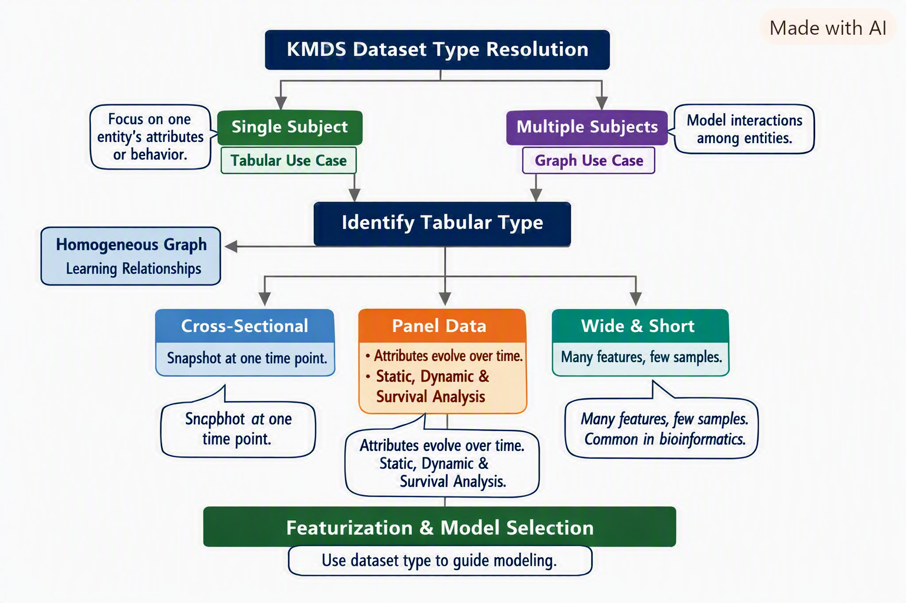
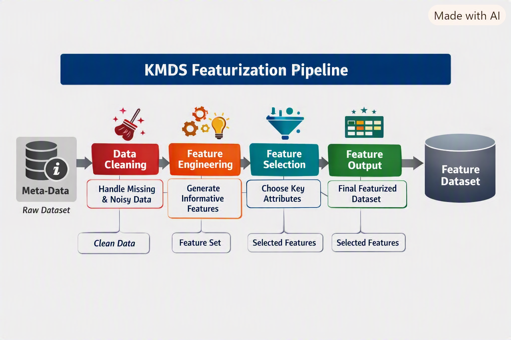
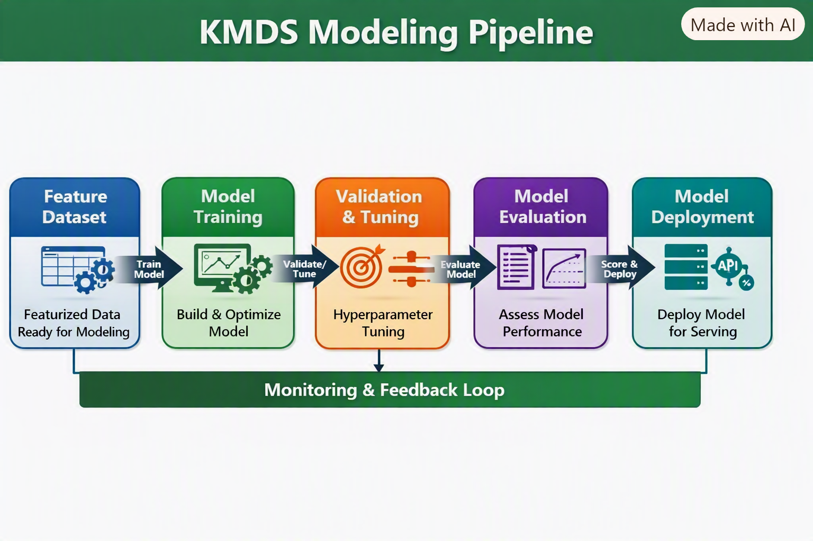
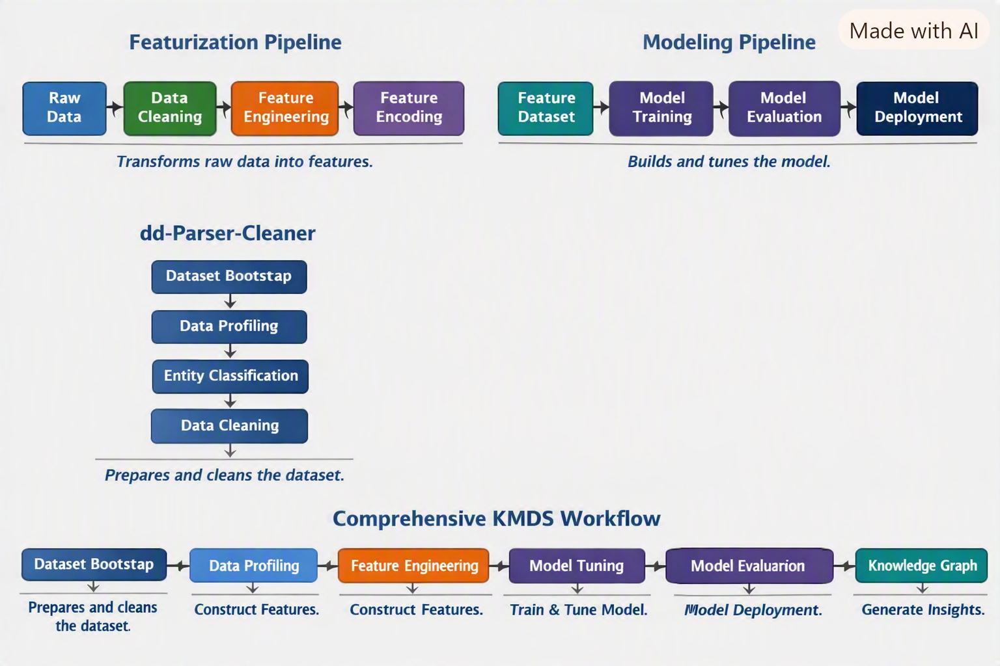

# KMDS Featurization and Modeling Workflow
KMDS is easiest to understand as a connected workflow built from a few focused components: `dd-parser-cleaner`, `kmds-featurization`, `kmds-modeling`, and `kmds-data-helper`. In this post, we describe how each component contributes to the end-to-end ML lifecycle for a use case. The key idea is simple: the workflow starts by bootstrapping the dataset, sets up the project and configuration, then builds modular feature-engineering and modeling stages. After the model is trained, `kmds-data-helper` materializes the project into a KMDS knowledge graph that can be queried and updated in the KMDS UI, including through natural-language interactions.

## Overview
The `dd-parser-cleaner` component is the entry point for the workflow. It includes the dataset bootstrap utilities (`dataset-bootstrap`, `init-workspace`, and `bootstrap-config`) that inspect the raw tabular data, infer the dataset type, and initialize the project metadata and configuration needed downstream. Once that foundation is in place, `kmds-featurization` defines the feature pipeline, `kmds-modeling` trains and evaluates the learning task, and `kmds-data-helper` converts the project into a KMDS knowledge graph. Together, these components produce a complete ML solution for a given use case.

{#fig-dataset-classification}

The dataset type determination is shown in Figure @fig-dataset-classification.

## Core Idea
`dd-parser-cleaner` does more than display raw tables; it bootstraps the dataset and establishes the project context for the rest of the workflow. The metadata and project configuration produced here tell us about data types, entity roles, missing values, and the project structure needed to support downstream modeling decisions. The resolved dataset type then guides the learning task and the design of the modular pipeline.

- **Dataset Bootstrapping** → Use `dataset-bootstrap` in `dd-parser-cleaner` to inspect the raw data and classify the dataset.
- **Workspace Initialization** → Use `init-workspace` and `bootstrap-config` to initialize project metadata and configuration.
- **Featurization Pipeline** → Sequential stages that transform raw data into model-ready features via `kmds-featurization`.
- **Modeling Pipeline** → Sequential stages that train, evaluate, and prepare models through `kmds-modeling`.
- **Knowledge Graph Generation** → Use `kmds-data-helper` to generate a KMDS knowledge graph for the project.

Each pipeline is a **linear chain of stages**, and both follow best practices defined in the **advisor modules**. The important connection is that the output of one stage becomes the input to the next: dataset metadata → workspace setup → featurization → modeling → knowledge graph.

{#fig-kmds-featurization}

A schematic illustrating how `kmds-featurization` builds on the metadata generated by `dd-parser-cleaner` and the problem definition is shown in Figure @fig-kmds-featurization.

The data scientist uses the featurization metadata and the modeling plan for the problem to develop the models, as shown in the schematic in Figure @fig-kmds-modeling.

{#fig-kmds-modeling}

This makes the workflow feel consistent: `dd-parser-cleaner` creates the project foundation, `kmds-featurization` turns the data into usable features, `kmds-modeling` learns from those features, and `kmds-data-helper` records the project state as a KMDS knowledge graph that can be explored in the KMDS UI.

## Introducing New Models

To add a new model type (for example, regression):

1. Create a **featurization pipeline** for regression.

2. Add regression best practices to the **featurization advisor**.

3. Add a **modeling pipeline** for regression.

4. Extend the **modeling advisor** with regression guidelines.

## Typical KMDS Workflow

1. **Dataset Resolution** → Use `dataset-bootstrap` in `dd-parser-cleaner` to identify the dataset type.

2. **Workspace Initialization** → Run `init-workspace` and `bootstrap-config` to set up project metadata and configuration.

3. **Feature Engineering** → Use `kmds-featurization` to define the feature pipeline for the use case.

4. **Model Training & Evaluation** → Use `kmds-modeling` to train, validate, and score the model.

5. **Knowledge Graph Creation** → Run `kmds-data-helper` to generate a KMDS knowledge graph from the project workspace.

6. **KMDS UI Interaction** → Query and update the knowledge graph in the KMDS UI; natural-language querying is supported.

The interaction between the KMDS components is shown in the schematic in Figure @fig-parser-cleaner-feat-modeling-interaction.

{#fig-parser-cleaner-feat-modeling-interaction}

---

## Example: SBA Loan Classification Project

### Problem Setup
The SBA loan dataset represents an **imbalanced classification problem**.  
The data scientist’s plan to solve it unfolds as follows:

1. **Active Loan Isolation** → Identify loans without a determined status (active loans).  
2. **Dataset Split** → From loans with clear labels (paid in full or charged off), create training, validation, and test sets.  
3. **Feature Engineering Workflow** →  
   - Engineer features on the training set.  
   - Validate and tune on the validation set.  
   - Estimate performance on the test set.

### Featurization Steps
4. **Similarity Feature** →  
   - Cluster distressed (charged-off) loans.  
   - Compute distance to nearest *paid-in-full* and *charged-off* cluster centers.  
   - Build a featurization pipeline for this computation.

5. **Geocoding Feature** →  
   - Convert borrower addresses to latitude and longitude.  
   - Implement a pipeline stage for geocoding.

6. **Categorical Encoding** →  
   - Apply **target encoding** to categorical attributes.  
   - Ensure only levels with sufficient support are encoded; low-support levels are grouped separately.  
   - Merge clustering, geocoding, and encoded features into a unified pipeline.

7. **Advisor Recommendations** →  
   - Use the **featurization advisor** to review best practices for imbalanced tabular classification.  
   - Optionally augment or modify the knowledge base for this problem type.

8. **Featurization Complete** →  
   - Dataset is now ready for modeling.

---

### Modeling Steps
9. **Model Choice** →  
   - Consider ensemble tree-based solutions:  
     1. Gradient Boosted Trees  
     2. Random Forest  

10. **Validation & Tuning** →  
    - Tune hyperparameters (number of trees, learning rate, etc.) on the validation set.  
    - Select the model with best validation performance for final scoring.

11. **Scoring Active Loans** →  
    - Use the best model to score active loans.  
    - Apply a threshold tuned on the ROC curve (validation set) to handle imbalance.

12. **Modeling Advisor** →  
    - Consult the **modeling advisor** for recommendations on imbalanced classification.  
    - Implementation decisions remain at the data scientist’s discretion.

---

### Project Finalization
13. **Knowledge Graph Generation** →  
    - Run `kmds-data-helper` to generate a KMDS knowledge graph from the project workspace.

14. **Version Control** →  
    - Check in the project workspace as a Git repository.

15. **KMDS UI Access** →  
    - Team members and stakeholders can query and update the project’s knowledge graph in the KMDS UI.  
    - Natural language queries are supported — business users can explore the results without needing deep schema knowledge.

---

## Key Takeaways
- Dataset type resolution drives modeling strategy.  
- The `dd-parser-cleaner` utilities bootstrap the dataset and establish the project foundation.  
- `kmds-featurization` and `kmds-modeling` provide modular, sequential stages for feature development and model training.  
- `kmds-data-helper` converts the project into a KMDS knowledge graph.  
- The KMDS UI can query and update that graph, including through natural-language interactions.  
- KMDS integrates project metadata, feature engineering, modeling, and knowledge graph generation into a unified workflow for building ML solutions.
```
