::: {.callout-note appearance="simple"}

## Note
This post originally used a different approach to the analysis. After its publication, I realized there was a much simpler and more intuitive way to perform the analysis. While the original post's approach is still valid, the new one is more straightforward and easier to understand. I believe it serves as a reusable template. I have updated the post to reflect this new approach. The original version is available in the git history of this repository if you are interested in reviewing it.
:::

::: {style="text-align: justify"}
## Why bother with time series analysis?

This post focuses on time series analysis—understanding the signal's past behavior—as distinct from time series modeling, which is for time series tasks like forecasting. The initial step in analysis is to smooth the signal to reveal its core components: trend, cycles, seasonality, and noise.

Understanding this structure is crucial. It allows modelers to focus their efforts on the most significant components and provides end-users with actionable insights for planning and control. While modern forecasting methods like deep learning can be effective without this explicit step, structural analysis remains invaluable for a deeper understanding of the data.

Traditional analysis often uses filtering techniques like Savitzky-Golay or LOESS, which require tuning multiple parameters (e.g., window size, polynomial characteristics). You start with applying an appropriate filter, study the smoothed time series, then make an informed choice about a decomposition method. A more streamlined alternative is Singular Spectrum Analysis (SSA), which accomplishes the decomposition with a single, intuitive parameter: the window size. This parameter is typically selected based on the data's sampling frequency and the analytical goal (e.g., a window of 12 for monthly data to study yearly patterns).

My current workflow begins with SSA to decompose the signal and interpret its components. I then use these insights to set parameters for traditional filters like Savitzky-Golay and LOESS. This approach allows me to verify that all methods yield a consistent and robust interpretation of the time series structure. This post illustrates the application of this SSA-first methodology.

:::

::: {style="text-align: justify"}
## What is Singular Spectrum Analysis?

SSA decomposes time series into components using a single parameter: window size. It creates a trajectory matrix by sliding a window over the series, then applies singular value decomposition (SVD) to extract underlying components.

Imagine observing consecutive points in a window and sliding it across the series. This matrix captures dynamics, allowing SVD to reveal variance components. Components are like principal components: ordered by explained variance.

Plot components, check correlations, and group them into trend, seasonality, noise, or custom categories. Sum groups to reconstruct signals, excluding noise for smoothing.

The only parameter is window size, selected based on data (e.g., 12 for yearly patterns in monthly data). For more details, see the [Wikipedia page](https://en.wikipedia.org/wiki/Singular_spectrum_analysis) or Golyandina's book \cite{golyandina2001ssa}.

{fig-align="center"}

SSA yields components explaining total variation. Order by variance, examine plots and correlations, then group as needed. Reconstruct by summing groups, omitting noise for a smoothed signal. Profile results for your application. Details follow below, starting with example datasets.

:::

::: {style="text-align: justify"}
## Some examples of time series datasets

The following datasets are used to illustrate the application of SSA.

1. Coffee Dataset: This data is from the Federal Reserve Bank of St. Louis. The data is a time series of coffee prices in cents per pound, recorded on the first day of each month from 1991 through 2025 [@stlouisfedGlobalPrice]. A window size of 12 (representing a year) was used for the analysis, and it gave good results.

2. Energy Dataset: This data was obtained from \emph{Kaggle} [@kaggle]. The data is from an energy platform in Spain managed by a group of transmission system operators in Spain. For this analysis, biomass-generated energy was selected. There was one missing value, which was imputed. The data is available as an hourly time series for a period of 4 years. A window size of 24 (representing a day) yielded good results.

3. Car Sales Dataset: This data was also obtained from \emph{Kaggle} [@kaggle]. The data is a time series of car sales in Quebec, Canada, from 1960 through 1968. Research on the original source of this data points to a website at York University [@yorkTimeSeries]. A window size of 12 (representing a year) was used for the analysis initially. A window size of 24 yielded better results and was used for the final analysis.

Note that all three datasets are sampled at regular intervals. Regularly sampled data is very common. Most monitoring and data collection schemes usually collect samples at regular intervals. If there were missing values, these would have to be imputed before applying SSA. The datasets were selected to demonstrate the methodology described in this paper and are not intended to be representative of all types of time series data. The methodology can be applied to any time series data, but the results may vary depending on the characteristics of the data.

:::

::: {style="text-align: justify"}
## Interpreting the Eigen Value Plot

The eigenvalues you get from the _Singular Value Decomposition_ can be ordered in decreasing order. The variance explained by this signal component is the ratio of its magnitude to the sum of all eigenvalues. By plotting the explained variance in a cumulative manner, you can quickly size up the signal components that are relevant to your application. The size of the eigenvalue is proportional to the variance explained by the eigenvalue. With most datasets, it turns out that a small number of eigenvalues explain most of the variation. If you plot the size (mathematically, the norm) of the eigenvalue you usually get plots that decay very quickly. 

<!-- plots for coffee - ev, exp var, cexpvar -->
:::{layout-ncol=3}
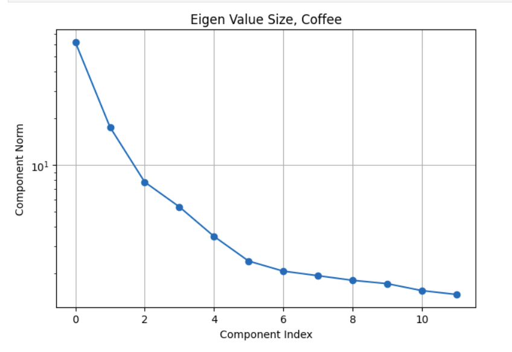

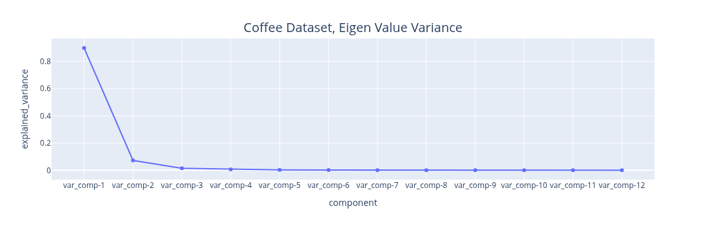

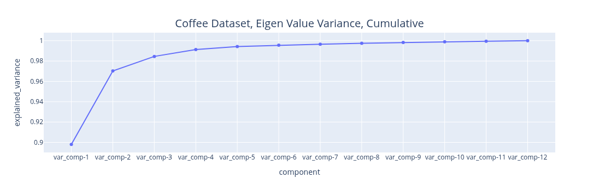
:::

The plots above illustrate the eigenvalue plots for coffee. If you review the second plot with reference to the first plot, you can see that the proportion of the variance explained is directly related to the size of the eigenvalue. The last plot is a cumulative plot of the explained variance. In this plot, the eigenvalues are distinct and the dataset has no seasonalities. This pattern changes when the time series has seasonalities. As you can see with the same plots shown for the car sales dataset below. 

<!-- plots for car sales - ev, exp var, cexpvar -->
:::{layout-ncol=3}
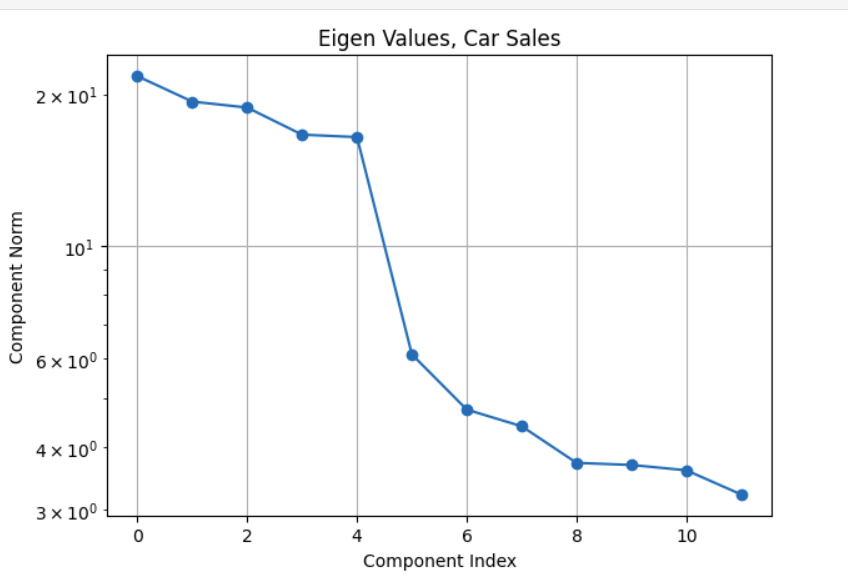

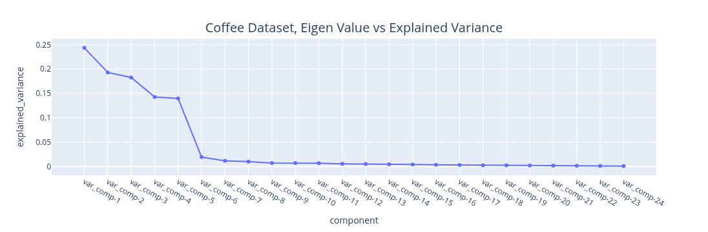

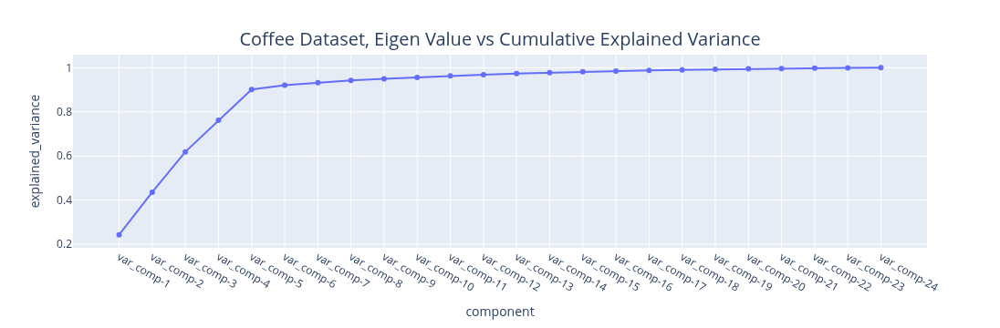
:::
The fact about the variance explained being directly related to the size of the eigenvalue still holds (it is an SSA property). The feature to note in the plot of the eigenvalues for the car sales is the nearly similar values of eigenvalues 3 and 4. Whenever we have a seasonality in the dataset, we will see a pair of eigenvalues that are very similar in magnitude. It turns out that this is because a harmonic component (a component that has a regular behavior) requires both _frequency_ and _phase_ for a complete specification and this is what the pair of eigenvalues encode. While on this subject of seasonality, it is important to contrast this with _trend cycles_. These have an up and down behavior, they are just not periodic. Usually, most decomposition software implementations group trend cycles with the trend component. So if you see a pair of eigenvalues of similar size, they encode a seasonal component. If the size of the eigenvalue is not small, they contribute towards explaining a sizeable amount of variation in the data. This brings up the question of what constitutes a sizeable variation? This is application specific. For example, if you are using this analysis results to inform a downstream forecasting task. You may want to extract as many signals as needed to make the remainder behave like Independent, Identically, Distributed noise. How do you know if the signal that is remaining has no correlation? You can use the _Durbin-Watson_[@durbin1950testing] test from the statsmodels package[@seabold2010statsmodels]. If your test statistic reports a statistic in the range of 1.5 to 2.5, it is generally okay to conclude there is no correlation in the noise. If your noise model is _Gaussian_, which is a common assumption, then no correlation, in a joint distribution sense, implies independence. You can run the PELT change point detection algorithm [@Killick01122012], implemented in the _ruptures_ package[@truong2020selective] to see if the algorithm reports any change points. No change points suggests _homogeneous_ noise. So, using the _Durbin-Watson_ test and the _PELT_ change point detection you can verify if IID is a reasonable assumption for your noise.
If you are not going to use the analysis results for a downstream task that is based on a specific _probabilistic model structure_, then you may decide based on a variance threshold that is adequate for that application. For example, finding motifs (patterns) or segmenting your time series may be the downstream task you are interested in. In that case you can stop with signals you are interested in analyzing. You may not care that the signal that you are not interested in has some serial correlation. The Matrix Profile [@yeh2016matrix] and the excellent python implementation [@law2019stumpy] and great resources for these tasks. Change point detection is another example. This was used as the pivotal step in the previous analysis approach. It turns out that the signal we extract from the first few eigenvectors is smooth. We can use the traditional derivative test, or, analogously, peak finding algorithms to find the change points in the signal. The _find-peaks_ method in [@2020SciPy-NMeth] can be used for this. The meaning and the relevance of the change points is application dependent. You may not care about the noise since it explains very little variance.

The key points to note with reading the eigenvalue plot are:

1. The size is proportional to variance explained.

2. If there are seasonalities of consequence, you should see pairs of similar eigenvalues.

3. Decide on what is noise based on your application needs and _verify it if your application needs a specific noise structure_.

:::

::: {style="text-align: justify"}
## Grouping the Components

Okay, so now that you have picked the components that matter to your application and the components that don't (the noise), you can understand the structure of the components that matter and annotate them. This means you can pick subsets of these components, combine them and give them a name. How you group the components is application dependent, but here are some guidelines. You can compute the correlation between the components that you extracted.

1. Plot the correlation between components. Often, components that are correlated mean that the components are related to the same underlying physical phenomenon. 

2. Interpret these components in the context of the application. The application context may give you some ideas about which components should be grouped together.

3. While trend, seasonality and noise are a common decomposition grouping, SSA lets you define your own. So, you have flexibility here. This is one of the benefits of SSA. You get resolution in the decomposition. The analyst can profile the data at a fine granularity. The point to note is that grouping is subjective.

4. One particular grouping of interest is one with two groups. One with all the components that you consider noise, the other being the components that you consider signal (everything other than the noise). You can use the signal to represent the smoothed version of the data. We will use this grouping to verify the SSA results.

I will discuss one dataset, the coffee dataset, that should provide sufficient illustration to apply it to other datasets. In any case, the implementation repository contains the details of the other dataset. We start with examining the _weighted correlation_ plot for the SSA components. The weights are assigned for each data point. For this dataset, the first 3 components explain over 98 percent of the total variance. A review of the correlation plot shows that they are correlated, suggesting they are all related to the same underlying data generating process, so we group them together. _Trend_ is the name assigned to this group. There is no explicit seasonality with this dataset. Therefore, everything else is noise. The _Durbin-Watson_ test statistic for the noise was 1.7. A test statistic in the 1.5 to 2.5 range is generally considered sufficient to conclude that the noise is uncorrelated. If the noise model is _Gaussian_, then this also implies independence. The _Kernel Density Plot_ suggests that this might be a reasonable assumption. We still need to check if the noise is homogeneous. We can do this by running a change point detection algorithm on the noise. PELT with the RBF kernel (corresponding to the Gaussian noise model) is used. This algorithm did not find any change points in the noise. So IID noise may be a reasonable assumption for this decomposition. 

:::{layout-ncol=3}
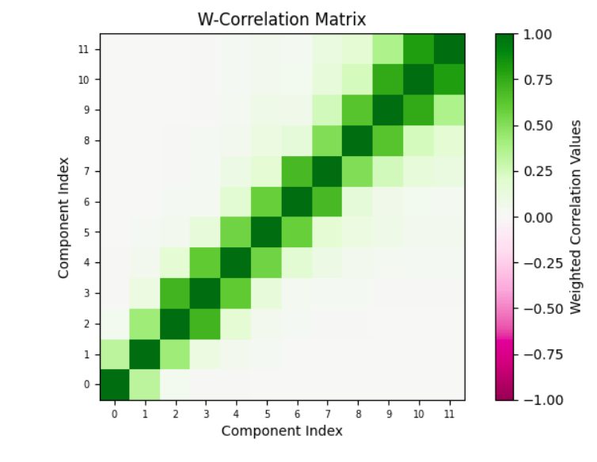

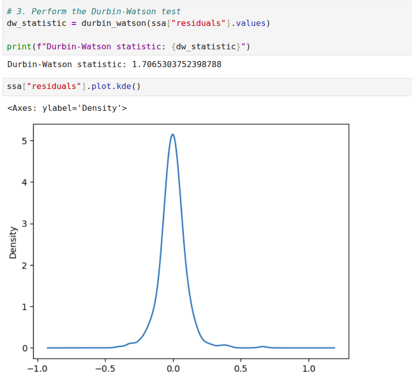

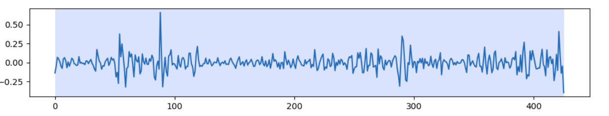
:::

:::

::: {style="text-align: justify"}
## Verifying the Analysis Results

At this point, we have set up SSA, run it, grouped the components, and analyzed the noise. We can combine everything that is not noise as a _smoothed_ version of the signal and compare it with the original signal. A very important point to note is that for just the SSA analysis, we are not assuming any kind of model. For a specific downstream task, for example, forecasting, you can assume a noise model because it fits a specific model, for example, the _Gauss-Markov_ model. If your downstream task does not have a probabilistic model, you don't need to assume any model for the noise. If we just stop with _Singular Spectrum Analysis_ then, the explained variance of the smoothed signal and the original signal can be compared. This is one measure of the quality of the analysis.

For some signals, a _Monte Carlo_ simulation may make sense. This fits a model to the smoothed data and then generates copies of the dataset. For each dataset, an SSA decomposition is performed. Each decomposition provides a set of eigenvalues. If you perform 100 simulations, you can get 100 sets of eigenvalues and you can generate a confidence interval for each eigenvalue. Now, for some datasets this may make sense, for example in atmospheric simulations for the short term, this may be okay. The weather next week may be similar to the weather last week. However, for the coffee dataset, assuming all 35 year periods will be similar to the one we observed, may not be a good idea. So you can use _Monte Carlo_ simulation if that is a reasonable assumption for your use case, not as a general validation method, at least in my view. I have done this for the energy dataset, _for illustration_, don't read more into it. I am not criticizing _Monte Carlo_ simulation, it can be used if it is appropriate.

Another way to validate the analysis is to compare the reconstruction with other smoothers, such as the LOESS and Savitzky-Golay filters. The problem is that this is a trial and error method. You need to start with some parameters for the window and the polynomial. In a few experiments you can find out if the smoother is _similar_. The results of _SSA_ can also help you choose parameters for this method. For example, if there is no seasonality, you can make choices that reflect this. Multiple seasonalities may require higher degree polynomials. For example, the polynomial degree for the car sales dataset is higher than the coffee dataset. This is a sanity check to verify if _SSA_ and other methods are pointing the same general truth. Most certainly, these other methods have champion users who know how to tune it, for the mere mortals, _SSA_ may be quicker to tune and get to a similar result.

:::{layout-nrow=2}
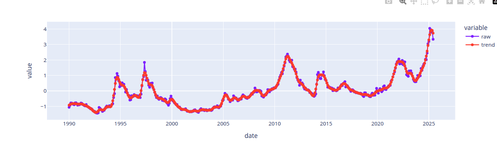

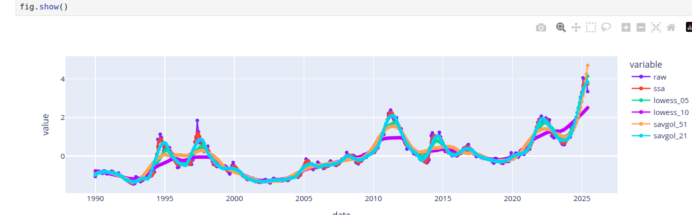

:::

The first image above shows the reconstruction obtained with _SSA_. The next image compares the smoothers obtained from LOESS, Savitzky-Golay and _SSA_. Different parameter choices for Savitzky-Golay and LOESS provide different qualities of reconstruction. Hitting the right range requires tuning effort. In general, the best smoothers from LOESS and Savitzky-Golay smooth the signal similarly to SSA, so we can accept the smoother from SSA.

:::

::: {style="text-align: justify"}
## Documenting the Observations
[@gebru2021datasheets] is a publication that describes a method for describing datasets with datasheets similar to those we find for electronics. For time series data, the information from a decomposition method can provide such a profile. While it is really tempting to jump on the "automation" bandwagon, I think it is important for profiles to be validated by both domain and modeling experts. The best we can do is to automate parts of the process, come up with reasonable defaults, prompt with candidate explanations that are confirmed or corrected by a human expert. This effort is needed to prime the process. If the time series is stable and concepts are stable, then we can always resort to labeling these concepts and using labeling tools to profile and document the data. I have developed a 14-point data capture for developing a profile for these datasets based on the ideas discussed in this post. These are logged to a knowledge base. These can be exported to tools like _Notebook LM_ [@google_notebook_lm] to generate the documentation artifacts for these datasets.

:::

::: {style="text-align: justify"}

## Implementation Repository
The analysis for all the datasets is at [@sambasivan_ts_explore_26]. Check the notebooks folder for the notebook implementations. The knowledge graph extracts or the pdf versions of the notebooks can be used with notebook LM to create documentation based on this analysis. The knowledge graphs in the _kmds_ subfolder of the _data_ folder. The generative AI content is in the _generative ai_ folder.

:::

::: {style="text-align: justify"}
## Software Package
Currently, this workflow is illustrated through notebooks. I'm developing a template that automates SSA-based smoothing, capturing time series profiles in a knowledge graph for export to generative AI documentation tools. The SSA package will include:

1. **Window Selection Methodology**: A systematic approach to selecting window sizes based on sampling frequency and series length. Valid sizes range from 2 to $\frac{N}{2}$, where $N$ is the series length.
2. **Eigen Spectrum Analysis**: Methods for identifying trend, seasonality, and noise components based on eigenvalue decay patterns.
3. **Prompt Templates**: Automatically generated prompts based on features discovered during analysis.
4. **Feedback Integration**: Mechanisms for collecting and refining prompts iteratively.

Stay tuned.
:::
