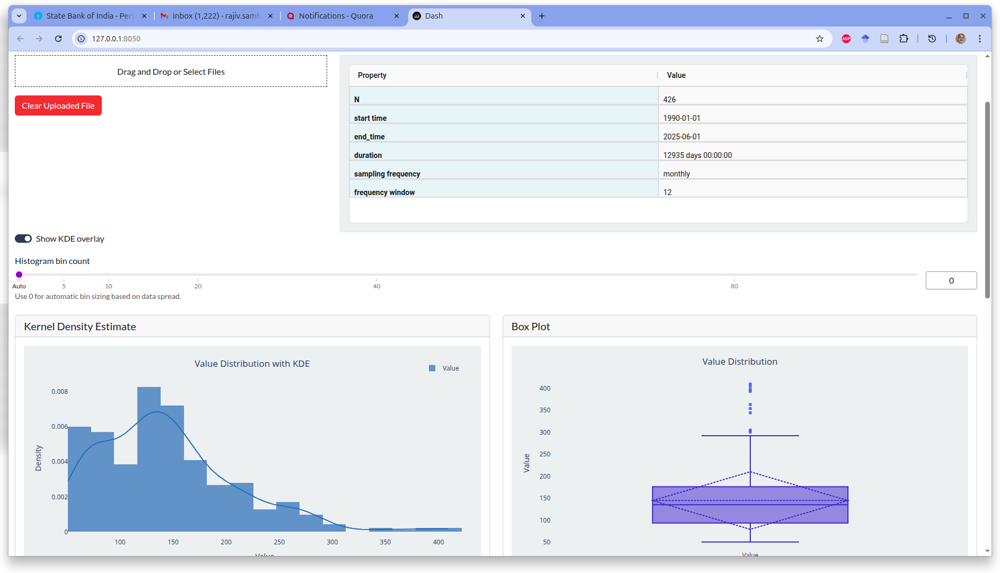
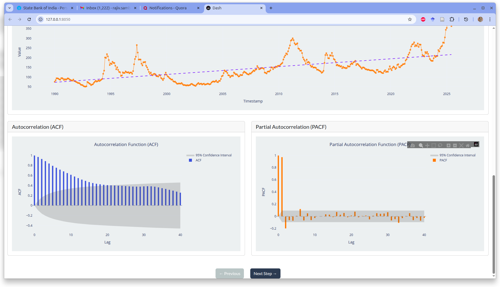
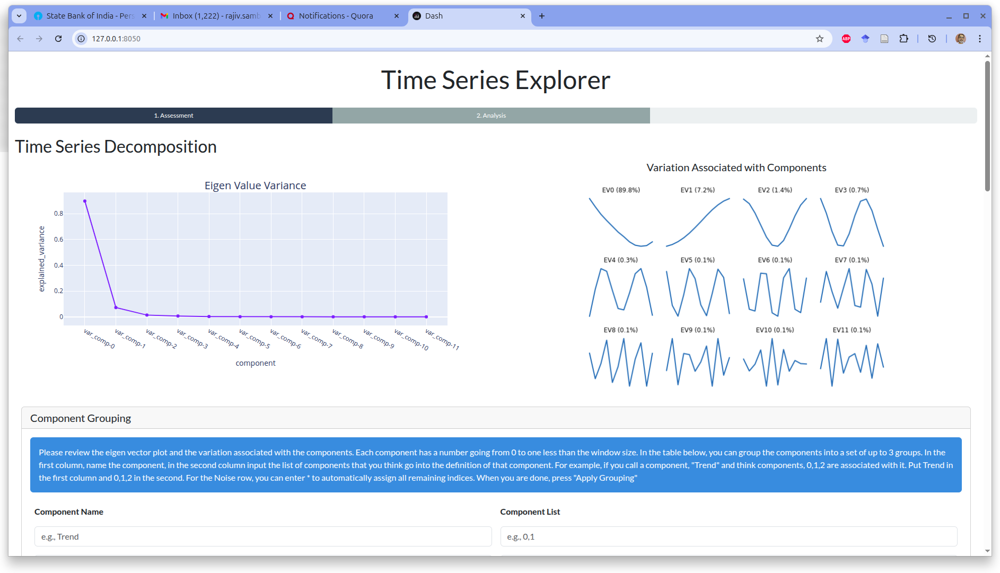
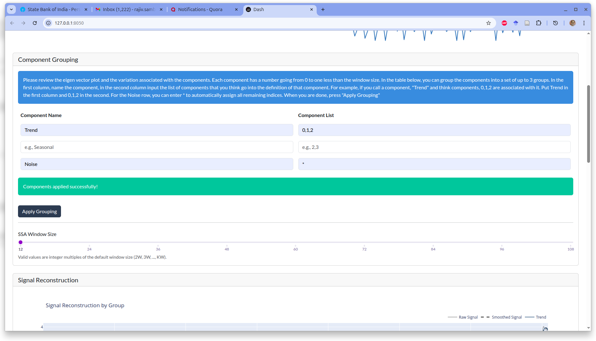
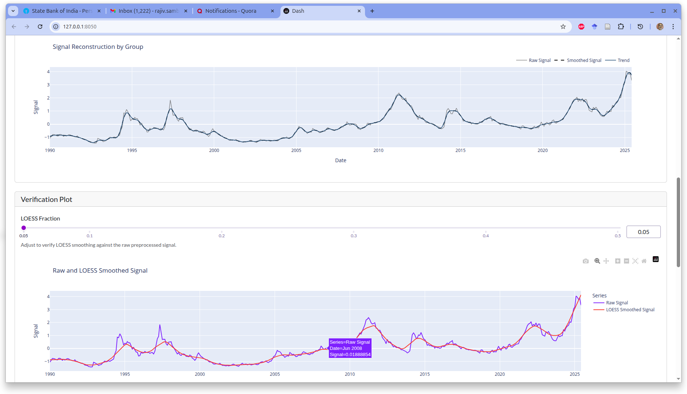
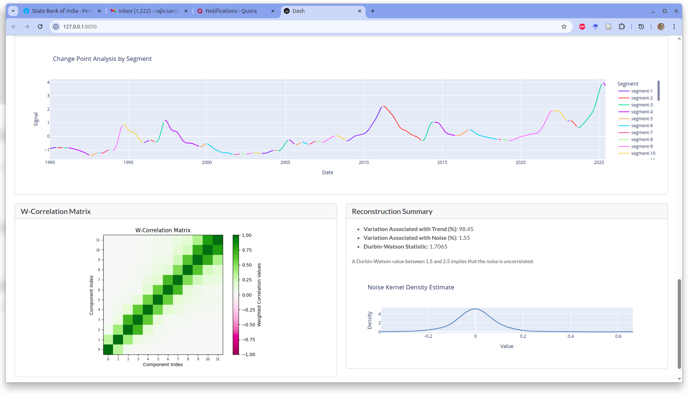
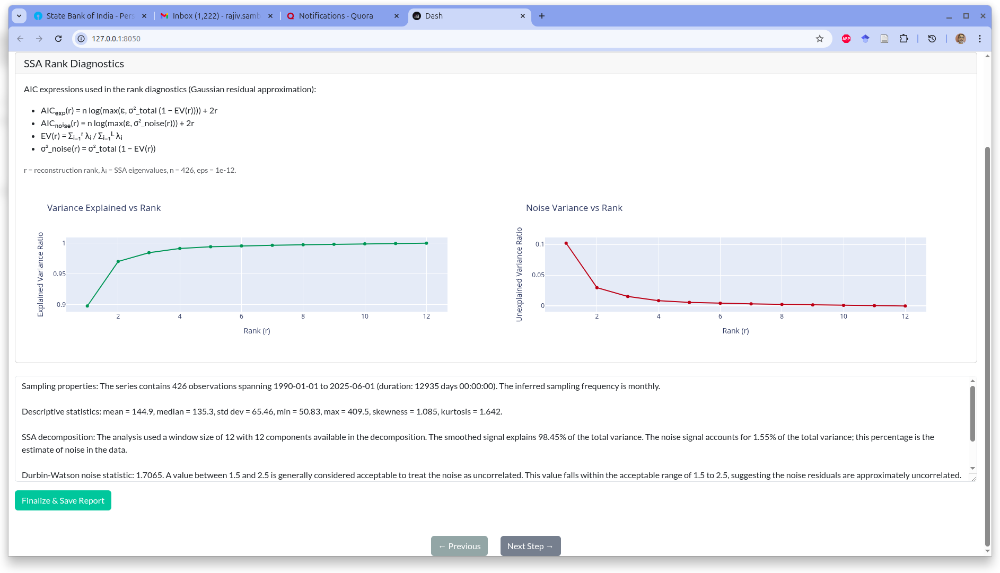

::: {style="text-align: justify"}
This is an update on a Python package I have been working on for the past few months. The package is called `tseda` (short for Time Series Exploratory Data Analysis). It is what I talked about in my [previous post](https://rajivsam.github.io/r2ds-blog/posts/markov_analysis_coffee_prices/), and I now have a basic version ready. I am currently working on the documentation and will be releasing it soon.

The usage scenario for `tseda` is as follows: you have a regularly sampled time series dataset with a sampling frequency of one hour or higher. You have some downstream task in mind (e.g. forecasting, anomaly detection, etc.), and you want to explore the structure in the data and get a sense of what it looks like. You want to do this quickly and easily, without having to write a lot of code. `tseda` is designed to help you with this.

## How `tseda` works

You can, of course, work through a notebook and use the various functions in `tseda` to explore your data. This is the most flexible way to use the package and allows you to customize your analysis as much as you want. However, there is a _Dash_ app built using `tseda` that allows you to explore your data in a more interactive way. Create a Python environment with Python 3.13 or higher. Activate it, install `tseda`, then run the command `tseda` in your terminal. This starts the Dash app, and you can explore your data using its various features.

There is a three-step workflow for using `tseda`:

### 1. Upload your time series CSV

The data should be in long format, with a timestamp column and a value column. You get an initial assessment of the data and its structure through the following:
    - A meta-summary of the data: sampling frequency, dataset size, etc. To use this tool, your data needs to have a sampling frequency of one hour or higher. If your data has missing values, you need to impute them before uploading to the app. The app does not handle missing values at the moment.
    - A kernel density plot and a box plot to show you some sense of the concentration of values and the spread of values in the data.
    - A plot of the raw data to give you a sense of the structure in the data. This is a line plot with time on the x-axis and value on the y-axis.
    - A PACF and ACF plot to give you a sense of the autocorrelation in the data. The ACF should also show you the seasonality in the data if there is any.

::: {.caption-center-grid layout-ncol="2" style="column-gap: 1.5rem;"}
::: {style="text-align: center;"}
{width="95%"}
:::
::: {style="text-align: center;"}
{width="95%"}
:::
:::

### 2. Decompose the signal with SSA

A decomposition of the data using SSA is done for you. This is based on a heuristic window selection. This should be reasonable for most datasets, but you can change the window size and see how the decomposition changes. You then pick the grouping of components for the decomposition. You do this by looking initially at the ACF plot, the eigenvector plots, and the explained variance plot. You apply the grouping and assess the quality of the decomposition by looking at the reconstructed components and the residuals. You can also look at the weighted correlation matrix to see how the components are correlated with each other. The grouping is important because it determines how the data is decomposed and what structure is captured in the various components. In data with strong structure (e.g. strong seasonality, strong trend, etc.), you can use the derivative idea to see where the signal changes. This is additional information that you get with this tool. If your data has weak structure (for example, if you upload white noise), this tool will indicate that it is not a good fit for your data.

::: {.caption-center-grid layout-ncol="2" style="column-gap: 1.5rem; row-gap: 1rem;"}
::: {style="text-align: center;"}
{width="95%"}
:::
::: {style="text-align: center;"}
{width="95%"}
:::
::: {style="text-align: center;"}
{width="95%"}
:::
::: {style="text-align: center;"}
{width="95%"}
:::
:::

### 3. Generate an AIC-based model selection report

An AIC-based model selection report is done for you. Recall that SSA is based on an eigen-decomposition of the trajectory matrix. The eigenvalues of the trajectory matrix can be used to determine the number of components to keep for the decomposition. The AIC-based model selection report shows explained variance and noise as a function of model rank. An automatic summary of all the plots and the report is generated for you. You can then correlate this with your monitoring, modeling, and control objectives, add or change anything you want, and save the report for future reference.

{fig-align="center" width="70%"}

The package is still in development, and I am working on the documentation. I will be releasing it soon. If you are interested in trying it out or contributing to the development, please check out the GitHub repository.

## Try `tseda` and follow updates

- Repository: [GitHub - tseda](https://github.com/rajivsam/tseda?utm_source=r2ds_blog&utm_medium=post&utm_campaign=tseda_announcement)
- Related background post: [Exploring Time Series Signals](https://rajivsam.github.io/r2ds-blog/posts/markov_analysis_coffee_prices/?utm_source=r2ds_blog&utm_medium=post&utm_campaign=tseda_announcement)

## FAQ

### What data does `tseda` support right now?

Regularly sampled time series with frequency of one hour or higher, uploaded as CSV in long format.

### Can I use `tseda` for forecasting directly?

`tseda` is focused on time series exploratory analysis and structural diagnostics. It is intended to improve downstream forecasting, anomaly detection, and monitoring workflows.
:::